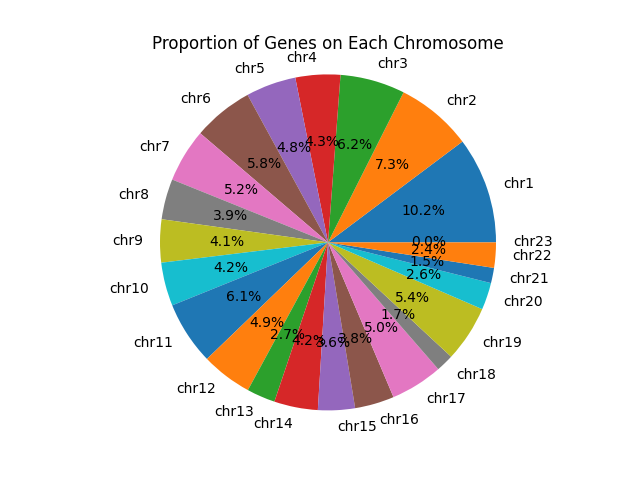

# Homework 8: "Holidapp" 
#### Scenario:
Your app (Flask API + Redis DB) has been deployed in Kubernetes, and now we are going to continue to build out some more features. First, we will write some code to dynamically assign the Redis client host IP. Second, we will add some functionality to write images to a Redis database and read images back out.

#### Objective:
Create a persistant API using redis and flask. Apply this to a k8s cluster and deploy the software system. Use multiple redis databases to store both text data and images. 

### Data:
The data for this homework set is a JSON file that contains information on genes found in the human genome, approved by the HGNC (HUGO Genome Nomenclature Committee). The HGNC sets standards for human gene nomenclature. 

This data set holds information on all the HGNC recocgnized genes. A full explanation of the data and each dictionary key can be found at the link below.

The data can be viewed here: [HGNC Data](https://www.genenames.org/download/archive/).


## Scripts:

`gene_api.py`:
Flask application for querying the genome data. The application should loads in the data mentioned above and provides flask routes for a user to digest the data and find specific data points and associated values.
The routes and returns are as follows.


| Route         | Method        | Return |
| ------------- |:-------------:| ------------- |
| `/data`     | GET | Return all data in Redis database | 
| | DELETE |  Delete data in Redis | 
| | POST | Put data into Redis | 
| `/genes`    | GET |  Returns the unique hgnc_id of all the genes in the data set      |
| `/genes/<hgnc_id>`  | GET |  Return all data associated with a specific hgnc_id |
| `/image`     | GET | Return the image from the Redis database | 
| | DELETE |  Delete the image in Redis | 
| | POST | Put an image into Redis | 


** Note: the variable `<hgnc_id>` takes the format "HGNC:1234", where 1234 is replaced with the unique ID number.


`Dockerfile`: Text document that contains the commands to assemble the `gene_api` Docker image that is used to produce the Docker container when ran. 

`docker-compose.yaml`: YAML script that orchestrates the containerization and port mapping of the flask app and redis database.

`kubernetes/jacksont-test-flask-deployment.yml`: YAML script that orchestrates deployment of 2 flask kubernetes pods

`kubernetes/jacksont-test-flask-service.yml`: YAML script that orchestrates deployment of flask kubernetes service

`kubernetes/jacksont-test-reds-deployment.yml`: YAML script that orchestrates deployment of reds kubernetes pods

`kubernetes/jacksont-test-redis-service.yml`: YAML script that orchestrates deployment of redis kubernetes service

`kubernetes/jacksont-test-pvc.yml`: YAML script that orchestrates deployment of a persistant volume claim, used by the redis pods. 


## Instructions and Installation: Deploying the Software System to a Kubernetes Cluster

### Initial Deployments
To deploy the software system to a kubernetes cluster, execture the following commands:
```bash
$ kubectl apply -f jacksont-test-pvc.yml
$ kubectl apply -f jacksont-test-redis-deployment.yml
$ kubectl apply -f jacksont-test-redis-service.yml
$ kubectl apply -f jacksont-test-flask-deployment
$ kubectl apply -f jacksont-test-flask-service
```
This will create the Persistant Volume Claim (PVC) that will store the redis database information independently of the active status of the flask app.
Along with the PVC, the k8s pods will be deployed for both the redis database and flask app. This can be viewed by executing the command below:

```bash
$ kubectl get pods -o wide
NAME                                              READY   STATUS    RESTARTS   AGE   IP               NODE            NOMINATED NODE   READINESS GATES
jacksont-test-flask-deployment-65b667b959-hgfjc   1/1     Running   0          29m   10.233.85.211    kube-worker-2   <none>           <none>
jacksont-test-flask-deployment-65b667b959-ztrnt   1/1     Running   0          29m   10.233.116.66    kube-worker-1   <none>           <none>
jacksont-test-redis-deployment-75d6f79b88-mbvnl   1/1     Running   0          29m   10.233.85.229    kube-worker-2   <none>           <none>
py-debug-deployment-f484b4b99-ms8wt               1/1     Running   0          26h   10.233.116.105   kube-worker-1   <none>           <none>
```

This will also create services that maintain a connection with the deployed pods, allowing existing pods to stop running and be replaced with new pods with no loss of connection between the flask app or redis database and their respective k8s service. This can be seen with the following command:
```bash
$ kubectl get service -o wide
NAME                          TYPE        CLUSTER-IP      EXTERNAL-IP   PORT(S)    AGE   SELECTOR
jacksont-test-flask-service   ClusterIP   10.233.15.189   <none>        5000/TCP   80m   app=jacksont-test-flask-deployment
jacksont-test-redis-service   ClusterIP   10.233.8.211    <none>        6379/TCP   26h   app=jacksont-test-redis-deployment
```
### Note on the Flask app image
It should be noticed that in the flask app deployment the image "jthet/gene_api:1.0" is pulled from docker hub. This can be found here: [Dockerhub Link to jthet/gene_api image](https://hub.docker.com/r/jthet/gene_api).

In order for the Flask container to get deployed to Kubernetes, it must come from Docker Hub. 

If you would like to replace this image with one of your own, change line 28 of jacksont-test-flask-deployment.yml to the public docker hub image you would like. 

To build a new image from the existing Dockerfile, execute the following commands:
Note: Dockerfile must be in the current directory when this command is executed.
```bash
$ docker build -t <dockerhubusername>/<code>:<version> .
```

The image can the be pushed to docker hub with the command

```bash
$ docker push <dockerhubusername>/<code>:<version>
```

To use the existing "jthet/gene_api:1.0" image, nothing needs to be done as it is already prescribed in the scripts. 

### Accessing the Software

Once all the deployment pods, services, and the pvc are running, the app can be accessed by using the `curl` command, as seen above, inside another k8s pod (typically a development one running a python image).

```bash
$ kubectl exec -it <dev-python-pod-name> -- /bin/bash
root@12234...$ curl <service-IP>:5000/ [ROUTE]
```

To get the `<service-IP>` execute the command:

```
jacksont@kube-access:~/my-coe332-hws/homework07$ kubectl get service -o wide
NAME                          TYPE        CLUSTER-IP      EXTERNAL-IP   PORT(S)    AGE   SELECTOR
jacksont-test-flask-service   ClusterIP   10.233.15.189   <none>        5000/TCP   80m   app=jacksont-test-flask-deployment
jacksont-test-redis-service   ClusterIP   10.233.8.211    <none>        6379/TCP   26h   app=jacksont-test-redis-deployment
```

and use the IP address associate with the flask service, in the case above: `10.233.15.189`.

No modifications to the flask app or YAML scripts are required as the name of the redis service is linked to the flask deployment yaml file and flask app python script.

See the "Using the flask app" section below for how to use the running flask app. 

## Instructions and Installation: Using Docker-Compose

#### IMPORTANT NOTE:
1) Before any use, it is required that an empty folder named "data" is created by the user, so that the user has writing priveleges.
This can be done with the following command:

```bash
$ mkdir data
```

2) If the file names are kept as is, then nothing has to be changed and the app will automatically find the redis IP address with the system environment variables. For this reason, it is recommended that none of the yaml file namees are changes. If they are, the spec.container.env.value must be the same as the redis service name. 

### Building the Docker image

#### Method 1: Pull and use your existing image from Docker Hub

To use the existing Docker Image run the following commands:
```bash
$ docker pull jthet/gene_api:1.0
```
This will add the image to the users docker images, which can be checked with the command 
```bash
$ docker images
REPOSITORY            TAG       IMAGE ID       CREATED         SIZE
jthet/gene_api        1.0       c8b0a0825328   4 hours ago     899MB
```

#### Method 2: Build a new image from existing Dockerfile
To build a new image from the existing Dockerfile, execute the following commands:
Note: Dockerfile must be in the current directory when this command is executed.
```bash
$ docker build -t <dockerhubusername>/<code>:<version> .
```
Example:
```bash
$ docker build -t jthet/gene_api:1.0 .
Sending build context to Docker daemon   7.68kB
Step 1/4 : FROM python:3.8.10
 ---> a369814a9797
Step 2/4 : RUN pip install Flask==2.2.0 redis requests
 ---> Using cache
 ---> 20dabd1acd2c
Step 3/4 : ADD ./gene_api.py /gene_api.py
 ---> 76fe0eec9b92
Step 4/4 : CMD ["python3", "/gene_api.py"]
 ---> Running in fe2c0f85b0db
Removing intermediate container fe2c0f85b0db
 ---> ba3e81e8f47f
Successfully built ba3e81e8f47f
Successfully tagged jthet/gene_api:1.0
```

Check the image was built with `$ docker images`:
```bash
$ docker images
REPOSITORY                 TAG        IMAGE ID       CREATED              SIZE
jthet/gene_api             1.0        2883079fad18   About a minute ago   928MB

```

### Launch the containerized app and Redis using docker-compose
After the image is created, use the command `docker-compose up`:

```bash
$ docker-compose up
Starting homework06_redis-db_1 ... done
.
.
.
flask-app_1  |  * Debugger is active!
flask-app_1  |  * Debugger PIN: 411-831-197
```
This will create 2 containers; the flask app and the redis database/

Check these containers exist with:
```bash
$ docker ps
CONTAINER ID   IMAGE                COMMAND                  CREATED              STATUS              PORTS                                       NAMES
9df1e28ee08e   jthet/gene_api:1.0   "python3 /gene_api.py"   About a minute ago   Up About a minute   0.0.0.0:5000->5000/tcp, :::5000->5000/tcp   homework06_flask-app_1
d00467cc9354   redis:7              "docker-entrypoint.s…"   3 hours ago          Up About a minute   0.0.0.0:6379->6379/tcp, :::6379->6379/tcp   homework06_redis-db_1

```

You can now use the flask-redis api through curl: see the "Running the Flask App" section

To close the containers use the command:

```bash
$ docker-compose down
Stopping homework06_flask-app_1 ... done
Stopping homework06_redis-db_1  ... done
Removing homework06_flask-app_1 ... done
Removing homework06_redis-db_1  ... done
Removing network homework06_default
```


## Using the Flask app
Each route can be accesd with the following:
```bash
$ curl localhost:5000/ [ROUTE]
```


All of the routes and example output are shown below.

Route: `/data -X POST`
```bash
$ curl localhost:5000/data -X POST
Data Loaded there are 43625 keys in the db
```


Route: `/data -X GET` or just `/data`
```bash
$ curl localhost:5000/data -X POST
.
.
.
  {
    "_version_": 1761544698841792512,
    "agr": "HGNC:52786",
    "date_approved_reserved": "2016-12-09",
    "date_modified": "2016-12-09",
    "ensembl_gene_id": "ENSG00000234148",
    "entrez_id": "101927424",
    "gene_group": [
      "Long intergenic non-protein coding RNAs"
    ],
    "gene_group_id": [
      1986
    ],
    "hgnc_id": "HGNC:52786",
    "location": "2q14.1",
    "location_sortable": "02q14.1",
    "locus_group": "non-coding RNA",
    "locus_type": "RNA, long non-coding",
    "name": "long intergenic non-protein coding RNA 1961",
    "refseq_accession": [
      "XR_007087198"
    ],
    "rna_central_id": [
      "URS0000EF0A8F"
    ],
    "status": "Approved",
    "symbol": "LINC01961",
    "uuid": "b2a7b185-0b99-409e-bae9-7709ead4ddc4",
    "vega_id": "OTTHUMG00000184091"
  }
]
```

Route: `/data -X DELETE`
```bash
$ curl localhost:5000/data -X DELETE
data deleted, there are 0 keys in the db
```


Route: `/genes`
```bash
$ curl localhost:5000/genes
.
.
.
  "HGNC:28298",
  "HGNC:46772",
  "HGNC:48882",
  "HGNC:45071",
  "HGNC:32955",
  "HGNC:54917",
  "HGNC:25579",
  "HGNC:3074",
  "HGNC:52786"
]
```
Route: `/genes/<hgnc_id>` 
```bash
$ curl localhost:5000/genes/HGNC:52786
{
  "_version_": 1761544698841792512,
  "agr": "HGNC:52786",
  "date_approved_reserved": "2016-12-09",
  "date_modified": "2016-12-09",
  "ensembl_gene_id": "ENSG00000234148",
  "entrez_id": "101927424",
  "gene_group": [
    "Long intergenic non-protein coding RNAs"
  ],
  "gene_group_id": [
    1986
  ],
  "hgnc_id": "HGNC:52786",
  "location": "2q14.1",
  "location_sortable": "02q14.1",
  "locus_group": "non-coding RNA",
  "locus_type": "RNA, long non-coding",
  "name": "long intergenic non-protein coding RNA 1961",
  "refseq_accession": [
    "XR_007087198"
  ],
  "rna_central_id": [
    "URS0000EF0A8F"
  ],
  "status": "Approved",
  "symbol": "LINC01961",
  "uuid": "b2a7b185-0b99-409e-bae9-7709ead4ddc4",
  "vega_id": "OTTHUMG00000184091"
}
```


Route: `/image -X POST`
```bash
$ curl localhost:5000/image -X POST
Image is posted
```

Route: `/image -X GET >> <FILE_NAME>`
```diff
$ curl localhost:5000/image -X GET >> image.png
  % Total    % Received % Xferd  Average Speed   Time    Time     Time  Current
                                 Dload  Upload   Total   Spent    Left  Speed
100 67574  100 67574    0     0  16.1M      0 --:--:-- --:--:-- --:--:-- 16.1M
$ ls
Dockerfile  README.md  config.yaml  data  docker-compose.yaml  gene_api.py  **image.png**  kubernetes
```
This will return an image with the same name that is piped initially. 
An example of this image is shown below:


Example if there are no images in the data base:
```
$ curl localhost:5000/image -X GET
No images in the Database
```


Route: `/image -X DELETE
```
$ curl localhost:5000/image -X DELETE
Plot deleted, there are 0 images in the db
```


